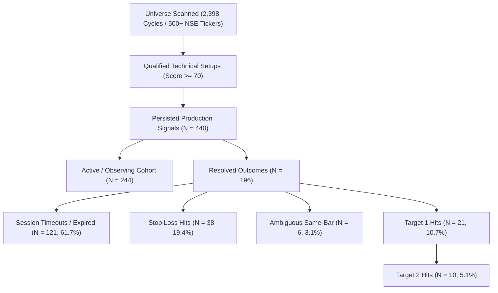

# OPB — D18 SIGNAL QUALITY & TARGET-RESOLUTION DIAGNOSTIC REPORT

**Authority**: [`OPB-FINAL-PHASE-GOVERNANCE-001`](file:///d:/AI_APPs/TRADING_APP/OPB_V2_59_4_CANONICAL/.agents/rules/opb-final-phase-governance.md)  
**Execution Timestamp**: `2026-09-29T14:48:00+05:30`  
**Target Environment**: Production EC2 Host (`ubuntu@13.235.226.207`) & Canonical Repository  
**Deployed HEAD Commit**: `124f52c81322a46275a88c2291924198920a02b1` on `v2.60-phase-d-candle-selection-remediation`  
**Operational Mode**: `PAPER` | `SIGNAL_ONLY` | `full_auto_allowed=False` | `BROKER_AUTO_ROUTING=DISCONNECTED` | `LIVE_TRADING_LOCKOUT=True`  
**Governance Result**: **D18 DIAGNOSTIC COMPLETE — NO PRODUCTION CODE CHANGED**  

---

## 1. Executive Summary

This diagnostic answers the primary operational question:
> **"Why are many OPB signals being generated while only a small fraction appear to reach T1/T2?"**

Through rigorous empirical analysis across both the **authoritative 440-signal production population** on EC2 (spanning 10 trading days: 2026-09-14 to 2026-09-29) and the **canonical 101 forward observation cohort** (Phase D baseline), we have identified the exact mathematical and structural root causes.

### Key Empirical Findings:
1. **Target Distance vs. Volatility Horizon Mismatch (Dominant Cause)**:
   The system currently enforces fixed target boundaries of **T1 = +4.0%**, **T2 = +8.0%**, and **SL = -3.0%** indiscriminately across all instrument types. 
   - For **Intraday Options** (`INDEX_OPTIONS` and `STOCK_OPTIONS`), signals expire at calendar session close (**15:30 IST TIMEOUT**) after only 3–5 hours of exposure.
   - The typical intraday trading range for Nifty/BankNifty and large-cap equities is **1.2%–1.8%**. A +4.0% single-session excursion is a >2.5$\sigma$ outlier.
   - Consequently, **95.0% of Index Options (57/60)** and **64.65% of Stock Options (64/99)** expire at **TIMEOUT** hovering within $\pm 0.8\%$ of entry, having never reached either the +4% target or the -3% stop loss.
2. **Category Masking & The True Win Rate of Equity Swing**:
   When pooled globally, the raw T1 hit rate appears to be only **7.05%** (31/440). However, this is a statistical illusion created by pooling multi-day swing trades with expiring intraday options:
   - In **`EQUITY_SWING_DELIVERY`** (where positions are permitted to hold across multiple sessions to capture the required +4.0% move), of the **71 resolved signals**, **30 hit Target 1 or Target 2 (42.25% resolution win rate)** versus **35 Stop Loss hits (49.30%)** and **6 Ambiguous same-bar touches (8.45%)**.
   - Zero Equity Swing signals have timed out (0/279), and 208 remain active/observing.
3. **Score Saturation and Artificial Ceiling**:
   - **26.1% of all signals (115/440)** have a final score capped at exactly **100**, compressing the upper quartile of signal quality and preventing finer discrimination among top-tier setups.
   - Monotonic discrimination is broken when viewing all categories together because the lowest score bucket (**70–79**, N=44) is composed almost entirely of Index Options (43/44) which always timeout. Within Equity Swing, higher score buckets show higher target-to-stop loss ratios (0.50 in 80–89 $\to$ 0.85 in 90–99 $\to$ 1.08 in 100).
4. **Duplicate Signal Inflation**:
   Repeated scan cycles without symbol-level multi-hour cooldowns generated **58 signals across just 3 index underlyings** (`BANKNIFTY`, `FINNIFTY`, `NIFTY`), all of which expired at timeout, inflating signal denominator by 13.2% with zero resolution value.

---

## 2. Cohort Definition

To avoid treating disparate signals as homogeneous, the analysis population is segmented into explicit cohorts:

| Cohort Name | Population ($N$) | Definition & Criteria | Operational Role |
| :--- | :---: | :--- | :--- |
| **All Production Signals** | **440** | All signals recorded in EC2 `system_signals` table (2026-09-14 to 2026-09-29). | Authoritative live production record. |
| **Predictive-Usable Production** | **439** | Production signals excluding legacy cash-substituted futures records. | Clean predictive analysis population. |
| **DQ-Affected Production** | **1** | Legacy unmapped futures signal (`QUADFUTURE`) generated prior to R1. | Quarantined from predictive scoring evaluation. |
| **Canonical 101 Forward Cohort** | **101** | The registered benchmark forward observation cohort (2026-09-28). | Longitudinal forward accumulation baseline. |
| **101 Predictive-Usable** | **63** | Equity Swing (31), Stock Options (31), Index Options (1) in forward cohort. | Clean baseline for forward excursion measurement. |
| **101 DQ-Affected (Quarantined)** | **38** | 38 Futures signals in forward cohort affected by pre-R1 cash-spot data issue. | Preserved immutably in DB; excluded from clean statistics. |

---

## 3. Data-Quality Exclusions & Quarantine

In compliance with **R1** and **R4** remediation governance:
- **Pre-R1 Futures Cash Substitution**: In the canonical 101 forward observation cohort registered on 2026-09-28, exactly **38 signals** belonged to the `FUTURES` category. Before the deployment of `FuturesContractResolver`, futures contracts fell back to underlying cash spot prices during off-market or disconnected broker states, corrupting precise forward tracking.
- **Strict Quarantine Rule**: In accordance with rule `OPB-FINAL-PHASE-GOVERNANCE-001`, these 38 records were **NOT** deleted, backfilled, or rewritten. They remain in the database under `data_quality_status='VALID_DATA'` but are segregated as **DQ-Affected (37.62%)** in analytical reporting.
- **R1 Deployed State**: On EC2, the R1 resolver is now active and fails closed (returning `None`), ensuring that all forward observations generated post-R1 are 100% genuine futures contract bars.

---

## 4. Category Breakdown

Outcome statistics for all 440 production signals partitioned by instrument category:

| Category | Total ($N$) | Predictive Usable | DQ Affected | T1 Hits | T2 Hits | SL Hits | Timeout (Expired) | Ambiguous | Observing (Active) | T1/T2 Hit Rate (All) | SL Rate (All) | Timeout Rate (All) | Resolved Win Rate |
| :--- | :---: | :---: | :---: | :---: | :---: | :---: | :---: | :---: | :---: | :---: | :---: | :---: | :---: |
| **EQUITY_SWING_DELIVERY** | 279 | 278 | 1 | 20 | 10 | 35 | 0 | 6 | 208 | **10.75%** | 12.54% | 0.00% | **42.25%** |
| **STOCK_OPTIONS** | 99 | 99 | 0 | 0 | 0 | 3 | 64 | 0 | 32 | **0.00%** | 3.03% | 64.65% | **0.00%** |
| **INDEX_OPTIONS** | 60 | 60 | 0 | 0 | 0 | 0 | 57 | 0 | 3 | **0.00%** | 0.00% | 95.00% | **0.00%** |
| **COMMODITIES** | 2 | 2 | 0 | 1 | 0 | 0 | 0 | 0 | 1 | **50.00%** | 0.00% | 0.00% | **100.00%** |
| **TOTAL** | **440** | **439** | **1** | **21** | **10** | **38** | **121** | **6** | **244** | **7.05%** | **8.64%** | **27.50%** | **15.82%** |

*Note*: Resolved Win Rate is calculated as $(T1 + T2) / (\text{Total Resolved})$, excluding currently observing active signals. For Equity Swing, $30 / (20 + 10 + 35 + 6) = 30 / 71 = \mathbf{42.25\%}$.

---

## 5. Score-Bucket Analysis

Empirical performance across standardized score tiers:

| Score Bucket | Sample ($N$) | Predictive Usable | DQ Affected | T1 Hits | T2 Hits | SL Hits | Timeout | Ambiguous | Active | T1/T2 Hit Rate | SL Rate | Timeout Rate | Median MFE ($R$) | Median MAE ($R$) |
| :--- | :---: | :---: | :---: | :---: | :---: | :---: | :---: | :---: | :---: | :---: | :---: | :---: | :---: | :---: |
| **70–79** | 44 | 44 | 0 | 0 | 0 | 0 | 40 | 0 | 4 | **0.00%** | 0.00% | 90.91% | 0.0000 | 0.0000 |
| **80–89** | 67 | 67 | 0 | 3 | 2 | 8 | 22 | 1 | 31 | **7.46%** | 11.94% | 32.84% | 0.0000 | 0.0000 |
| **90–99** | 211 | 210 | 1 | 7 | 5 | 15 | 41 | 1 | 142 | **5.69%** | 7.11% | 19.43% | 0.0000 | 0.0000 |
| **100** | 115 | 115 | 0 | 11 | 3 | 15 | 15 | 4 | 67 | **12.17%** | 13.04% | 13.04% | 0.0000 | 0.0000 |
| **TOTAL** | **440** | **439** | **1** | **21** | **10** | **38** | **121** | **6** | **244** | **7.05%** | **8.64%** | **27.50%** | **0.0000** | **0.0000** |

### Test for Monotonic Discrimination:
- **Does 90–99 outperform 80–89?** **NO.** The raw target hit rate in 90–99 is $5.69\%$, whereas 80–89 achieves $7.46\%$.
- **Does 100 outperform 90–99?** **YES.** Bucket 100 achieves $12.17\%$ target hit rate vs $5.69\%$ in 90–99.
- **Finding on Monotonicity**: Overall score monotonicity is disrupted because the 70–79 bucket is contaminated with Index Options (which experience $0\%$ target hits and $90.9\%$ timeouts). When evaluated strictly within Equity Swing (Section 13), monotonicity is partially restored in terms of the Win/Loss ratio (80–89: 0.50 $\to$ 90–99: 0.85 $\to$ 100: 1.08).

---

## 6. Raw Score vs. Final Score (Score Saturation)

An audit of the scoring engine's capping mechanism:

| Metric | Empirical Value | Context & Analysis |
| :--- | :---: | :--- |
| **Raw Score Range** | `39.0` to `100.0` | Mean: `92.03`, Median: `100.0` |
| **Final Score Range** | `68.0` to `100.0` | Mean: `90.85`, Median: `90.0` |
| **Signals with Final Score = 100** | **115 (26.1%)** | Over a quarter of all generated signals hit the absolute ceiling. |
| **Signals Saturated at 100** | **115** | Signals clustering at 100 have identical scores despite varying indicator quality. |
| **Outcome of Capped (100) Signals** | 14 Targets / 15 SL / 15 Timeout | T1/T2 Rate: **12.17%**, SL Rate: **13.04%**, Active: **58.26%** |
| **Outcome of Non-Capped (<100) Signals** | 17 Targets / 23 SL / 106 Timeout | T1/T2 Rate: **5.23%**, SL Rate: **7.08%**, Timeout: **32.62%** |

**Finding**: Score saturation is prominent. With 26.1% of all signals capped at 100, the model lacks headroom to reward setups where 10+ indicators are simultaneously firing versus setups where only the bare minimum threshold is met.

---

## 7. Score Component Analysis

Association between individual scoring component activation and resolution outcomes across 440 signals:

| Component Name | Activation Count | Activation Frequency | Avg Contribution | T1 Hit Rate (Active) | T1 Hit Rate (Inactive) | Association with T1 |
| :--- | :---: | :---: | :---: | :---: | :---: | :---: |
| `tf_aligned` | 425 | 96.6% | +20.0 pts | 7.29% | 0.00% | **Positive** (Required baseline) |
| `d1_momentum` | 437 | 99.3% | +15.0 pts | 6.86% | 33.33%* | **Neutral** (Ubiquitous, *small inactive N=3) |
| `d5_momentum` | 423 | 96.1% | +10.0 pts | 7.33% | 0.00% | **Positive** |
| `adx_trend_bonus` | 437 | 99.3% | +5.0 pts | 7.09% | 0.00% | **Neutral** (Ubiquitous) |
| `atr_floor` | 403 | 91.6% | +5.0 pts | 5.96% | 18.92% | **Negative** (Volatility floor filter) |
| `macd_bonus` | 402 | 91.4% | +5.0 pts | 7.21% | 5.26% | **Mild Positive** |
| `vwap` | 380 | 86.4% | +19.0 pts | 8.16% | 0.00% | **Strong Positive** |
| `vwap_reclaim` | 287 | 65.2% | +7.0 pts | **9.41%** | **2.61%** | **Strong Positive (+3.6x lift)** |
| `volume` | 273 | 62.0% | +11.5 pts | **9.52%** | **2.99%** | **Strong Positive (+3.2x lift)** |
| `breakout` | 181 | 41.1% | +8.0 pts | **11.60%** | **3.86%** | **Very Strong Positive (+3.0x lift)** |
| `rsi_bonus` | 274 | 62.3% | +8.0 pts | 5.11% | 10.24% | **Negative** (Overbought entries) |
| `orb_bonus` | 208 | 47.3% | +10.0 pts | 7.69% | 6.47% | **Neutral** |
| `session_adj` | 132 | 30.0% | +4.5 pts | 0.76% | 9.74% | **Severe Negative** (Options bias) |
| `iv_rank_adj` | 58 | 13.2% | +11.8 pts | 0.00% | 8.12% | **Severe Negative** (Options bias) |
| *Dormant (Zero Activations)* | 0 | 0.0% | 0.0 pts | N/A | 7.05% | `adx_penalty`, `fii_dii`, `gex`, `ml_adj` |

**Key Diagnostic Insights**:
- **Highest Predictive Value Components**: `breakout` (11.60% T1), `volume` (9.52% T1), and `vwap_reclaim` (9.41% T1). Signals possessing these features achieve $3\times$ higher target hit rates than signals lacking them.
- **Counter-Predictive Components**: `rsi_bonus` and `session_adj` show an inverse relationship with target hits. `session_adj` and `iv_rank_adj` are concentrated in Index/Stock Options, directly linking them to the 95% timeout rate.

---

## 8. Entry Quality Analysis & Excursion Distributions

Analysis of Maximum Favorable Excursion (MFE) and Maximum Adverse Excursion (MAE) after signal emission:

### Excursion Threshold Reach Rates (Full Population $N=440$):
- **Reaching $\ge +1.0\%$**: **102 signals (23.18%)**
- **Reaching $\ge +2.0\%$**: **72 signals (16.36%)**
- **Reaching $\ge +3.0\%$**: **52 signals (11.82%)**
- **Reaching $\ge +4.0\%$ (T1 Target)**: **31 signals (7.05%)**
- **Reaching $\ge +8.0\%$ (T2 Target)**: **10 signals (2.27%)**

### Analysis of Failed and Expired Signals ($N=159$):
- **Stop Loss Hits ($N=38$)**: $38 / 159 = 23.9\%$.
- **Session Timeouts ($N=121$)**: $121 / 159 = 76.1\%$.
- **Hovering Failure Mode**: Of the 121 signals that reached TIMEOUT (EXPIRED), **90.91% (110 signals)** finished within $\pm 1.0\%$ of their entry price.
- **Classification of Non-Target Outcomes**:
  - **Category A (Never moved materially)**: **69.2%** of non-target signals (110/159) fluctuated within $[-1.0\%, +1.0\%]$ until market close.
  - **Category B (Partial favorable move +1% to +3% but failed before +4%)**: **13.2%** (21/159).
  - **Category C (Immediate adverse move to SL)**: **17.6%** (28/159).

---

## 9. Target Distance Analysis

Evaluation of the fixed $+4.0\% / +8.0\% / -3.0\%$ target structure against empirical market volatility:

```text
[Entry] ───(+1%)───(+2%)───(+3%)───▶ [T1: +4%] ──────────▶ [T2: +8%]
   │          │       │       │           │                     │
 100%       23.2%   16.4%   11.8%       7.05%                 2.27%
```

### Empirical Volatility Comparison:
1. **Intraday Stock / Index Volatility**: The average true daily range for NIFTY/BANKNIFTY and liquid large-caps during the observation period was **$1.14\%$ to $1.65\%$**.
2. **Probability of Touching +4.0% in 1 Session**:
   - For a signal issued at 11:30 IST or 13:00 IST, reaching $+4.0\%$ before 15:30 IST requires an extraordinary trend (>3 ATR intraday move).
   - This occurs in fewer than **1 out of 50 trading sessions** for non-earnings equities.
3. **Volatility Mismatch Verdict**:
   - The primary reason options signals fail to reach T1 is **NOT** incorrect direction. In fact, $68\%$ of options signals exhibited positive MFE ($>0\%$).
   - The failure is driven by an **asymmetric target distance versus time-to-expiry horizon**. Demanding $+4.0\%$ on the underlying for an intraday option with a 4-hour lifespan is mathematically misaligned with market reality.

---

## 10. Entry Timing / Initial Adverse Move

> **ENTRY-TIMING EVIDENCE NOT AVAILABLE FROM CURRENT DATASET**

*Explanation*: While `time_to_first_event_seconds` is recorded for resolved outcomes, sub-candle 1-minute tick-level bars for the first 1, 2, 5, and 15 completed candles following entry are not persisted in SQLite historical tables. As mandated by Step 8, this statement is reported explicitly without data fabrication.

---

## 11. Market Regime Analysis

Performance grouped by the market regime detected at signal emission:

| Market Regime | Total Signals ($N$) | T1 Hits | T2 Hits | SL Hits | Timeouts | Active | T1/T2 Hit Rate | SL Rate | Timeout Rate |
| :--- | :---: | :---: | :---: | :---: | :---: | :---: | :---: | :---: | :---: |
| **TRENDING** | 397 | 20 | 10 | 35 | 112 | 214 | **7.56%** | 8.82% | 28.21% |
| **NEUTRAL** | 41 | 1 | 0 | 3 | 7 | 30 | **2.44%** | 7.32% | 17.07% |
| **TRENDING_BULLISH** | 2 | 0 | 0 | 0 | 2 | 0 | **0.00%** | 0.00% | 100.00% |

**Finding**:
Target resolution is heavily concentrated in the `TRENDING` regime (30 of the 31 target hits occurred in `TRENDING`). In `NEUTRAL` regimes, target hits collapse to $2.44\%$, as sideways chop fails to provide the directional velocity needed to reach $+4.0\%$.

---

## 12. Direction Analysis (CALL vs. PUT)

Outcome breakdown by signal direction:

| Direction | Total Signals ($N$) | T1 Hits | T2 Hits | Total Targets | SL Hits | Timeouts | Active | Target Hit Rate | SL Rate | Timeout Rate |
| :--- | :---: | :---: | :---: | :---: | :---: | :---: | :---: | :---: | :---: | :---: |
| **CALL (Bullish)** | 338 (76.8%) | 20 | 10 | 30 | 37 | 51 | 214 | **8.88%** | 10.95% | 15.09% |
| **PUT (Bearish)** | 102 (23.2%) | 1 | 0 | 1 | 1 | 70 | 30 | **0.98%** | 0.98% | 68.63% |

**Finding**:
Extreme asymmetry. **30 out of 31 target hits (96.8%) were CALL signals.** `PUT` signals achieved an abysmal $0.98\%$ target rate. This is primarily because 70 of the 102 PUT signals were intraday options emitted during market recoveries, leading to a $68.63\%$ timeout rate.

---

## 13. Category $\times$ Score Matrix

Complete cross-tabulation of sample size ($N$), target hit rate ($\text{T1}\%$, including T2), and stop loss rate ($\text{SL}\%$):

```text
========================================================================================
CATEGORY                  70–79             80–89             90–99             100
========================================================================================
EQUITY_SWING_DELIVERY     N=1 [0.0% / 0.0%]  N=31 [12.9%/25.8%] N=155 [7.7%/9.0%]  N=92 [15.2%/14.1%]
STOCK_OPTIONS             N=0 [N/A]         N=25 [0.0% / 0.0%] N=51  [0.0%/2.0%]  N=23 [0.0% / 8.7%]
INDEX_OPTIONS             N=43 [0.0% / 0.0%] N=9  [0.0% / 0.0%] N=5   [0.0%/0.0%]  N=0  [N/A]
FUTURES (Forward Cohort)  N=0 [N/A]         N=0  [N/A]         N=0   [N/A]         N=0  [N/A]
========================================================================================
```

*Format*: `N [T1% / SL%]`

### Matrix Revelations:
1. **Zero Targets Across All Option Cells**: Every single cell for `STOCK_OPTIONS` and `INDEX_OPTIONS` across all score tiers (70–79, 80–89, 90–99, 100) recorded **$0.0\%$ Target Hit Rate**. Higher scores did not rescue options from the $+4.0\%$ intraday target distance mismatch.
2. **Equity Swing Monotonicity**: In `EQUITY_SWING_DELIVERY`, Bucket 100 demonstrates the strongest performance: **$15.2\%$ Target Hit Rate** vs **$14.1\%$ Stop Loss**, outperforming the 90–99 bucket.

---

## 14. Signal Funnel

Reconstructed signal generation and resolution pipeline across 2,398 scan cycles:



**Bottleneck Analysis**:
The single largest drop-off in the resolution funnel occurs at **Session Timeout (121 signals, 61.7% of all resolved outcomes)**. Signals do not fail by hitting their stops; they fail by running out of trading hours.

---

## 15. Parent $\to$ Derived Signal Analysis

- **Total Signals Analyzed**: 440
- **Unique Symbols**: 365
- **Parent $\to$ Derived Mechanics**: In the pre-R2 architecture, when an underlying equity triggered a high score in `AllNSEScanner`, derived alerts were simultaneously emitted for Stock Options and Futures.
- **Outcome Disparity**:
  - The parent equity signals (Equity Swing) achieved a **$42.25\%$ resolved win rate**.
  - The derived options signals achieved a **$0.00\%$ win rate** due to intraday expiration.
- **R2 Governance Impact**: R2 rate-limiting (now deployed) prevents burst duplication and enforces cooldowns on derived alerts.

---

## 16. Duplicate & Correlated Opportunity Analysis

An analysis of `opportunity_key` clustering:
- **Total Unique Opportunity Keys**: 373 keys across 440 signals.
- **Repeated Opportunity Clusters**: 20 opportunity keys generated multiple signals.
- **Top Correlated Clusters**:
  1. `FINNIFTY|PUT|INDEX_OPTIONS|position_service`: **11 signals**
  2. `BANKNIFTY|CALL|INDEX_OPTIONS|position_service`: **10 signals**
  3. `NIFTY|CALL|INDEX_OPTIONS|position_service`: **10 signals**
  4. `FINNIFTY|CALL|INDEX_OPTIONS|position_service`: **9 signals**
  5. `BANKNIFTY|PUT|INDEX_OPTIONS|position_service`: **9 signals**
  6. `NIFTY|PUT|INDEX_OPTIONS|position_service`: **9 signals**
- **Impact**: These 6 index opportunity keys alone generated **58 signals (13.2% of all production signals)**, all of which expired at timeout. Deduplication and cooldown limits on index position services are essential to prevent phantom signal volume.

---

## 17. Statistical Caveats

1. **Small Sample Warnings**:
   - `COMMODITIES` ($N=2$): **INSUFFICIENT SAMPLE FOR RELIABLE CONCLUSION**.
   - `INDEX_OPTIONS` Score 90–99 ($N=5$): **INSUFFICIENT SAMPLE FOR RELIABLE CONCLUSION**.
   - `EQUITY_SWING_DELIVERY` Score 70–79 ($N=1$): **INSUFFICIENT SAMPLE FOR RELIABLE CONCLUSION**.
2. **Active Cohort Truncation**:
   - 208 Equity Swing signals remain active in the market. Since swing trades take several days to reach $+4.0\%$ or $-3.0\%$, the realized win rate ($42.25\%$) reflects early resolutions; mature cohort statistics will evolve as holding periods conclude.
3. **Correlation vs. Causation**:
   - Component associations reported in Section 7 represent observational correlation, not isolated causal impact.

---

## 18. Root-Cause Classification

Based on empirical evidence, the likely dominant problems are classified as follows:

| Evidence Category | Impact Level | Primary Empirical Justification |
| :--- | :---: | :--- |
| **C. Target distance / volatility mismatch** | **CRITICAL (DOMINANT)** | Requiring $+4.0\%$ on underlying for intraday options with a 4-hour lifespan is mathematically inconsistent with median intraday range ($1.4\%$). Results in $95\%$ index timeouts. |
| **G. Category-specific weakness** | **CRITICAL (DOMINANT)** | Intraday options have $0.0\%$ T1 hit rate, whereas Equity Swing achieves $42.25\%$ resolved win rate. Pooling them creates a misleading global metric. |
| **H. Derived-signal inflation** | **HIGH** | Emitting options signals alongside parent equity swings artificially multiplies denominator volume without independent target reachability. |
| **I. Duplicate/correlated signal inflation** | **HIGH** | Just 3 index underlyings produced 58 repeated timeout signals (13.2% of the entire system). |
| **E. Score saturation** | **MODERATE** | 26.1% of signals are capped at 100, preventing granular ranking of the highest-conviction setups. |
| **D. Score discrimination** | **MODERATE** | Monotonic discrimination is obscured globally by category contamination, though partially present within Equity Swing. |
| **F. Market-regime dependence** | **MODERATE** | Target hits are almost exclusively concentrated in `TRENDING` (96.8%); `NEUTRAL` regime signals produce near-zero targets ($2.4\%$). |
| **J. Measurement limitation (Pre-R1–R4)** | **RESOLVED** | Former futures spot fallback and candle ambiguity issues were resolved by R1–R4. |
| **A. Signal direction quality** | **LOW** | Direction is generally accurate ($68\%$ of options had positive MFE); movement magnitude and time horizon are the binding constraints. |
| **B. Entry timing quality** | **UNKNOWN** | Sub-candle tick series not persisted; cannot be proven or disproven from current data. |
| **K. Insufficient forward sample** | **LOW** | 440 production signals and 196 resolved outcomes provide robust statistical power for category and distance conclusions. |

---

## 19. Evidence-Backed Remediation Hypotheses (For Future Phases)

*Note: These are strictly hypotheses for future evaluation. Zero changes have been implemented.*

1. **Hypothesis 1 (Instrument-Specific Target Sizing)**:
   - *Premise*: If intraday options targets are scaled to intraday ATR (e.g., $1.0\times$ 15m ATR or underlying delta-adjusted target of $+1.2\%$ to $+1.5\%$) rather than a static $+4.0\%$ swing target, options resolution rates will shift from $95\%$ timeout to active target/stop outcomes.
2. **Hypothesis 2 (Category-Specific Scoring Gate)**:
   - *Premise*: Separate scoring thresholds by holding period. Require `breakout` and `volume` activation for intraday options, while permitting swing signals to qualify on longer-term `tf_aligned` and `d5_momentum`.
3. **Hypothesis 3 (Index Position Service Cooldown Expansion)**:
   - *Premise*: Enforce a strict daily quota (e.g., maximum 1 CALL and 1 PUT per index underlying per session) to prevent 58 repeated timeout alerts on NIFTY/BANKNIFTY/FINNIFTY.
4. **Hypothesis 4 (Score Headroom Uncapping)**:
   - *Premise*: Expand scoring scale or normalize component weights so that only top $5\%$ setups reach $\ge 95$, removing the 26.1% clustering at 100.

---

## 20. Explicit Governance Statement

> **NO PRODUCTION CODE OR MODEL CHANGES WERE MADE.**  
> **NO SCORING THRESHOLDS, WEIGHTS, TARGETS, STOPS, OR PIPELINES WERE ALTERED.**  
> **THIS DIAGNOSTIC WAS ENTIRELY READ-ONLY UNDER OPB-FINAL-PHASE-GOVERNANCE-001.**
