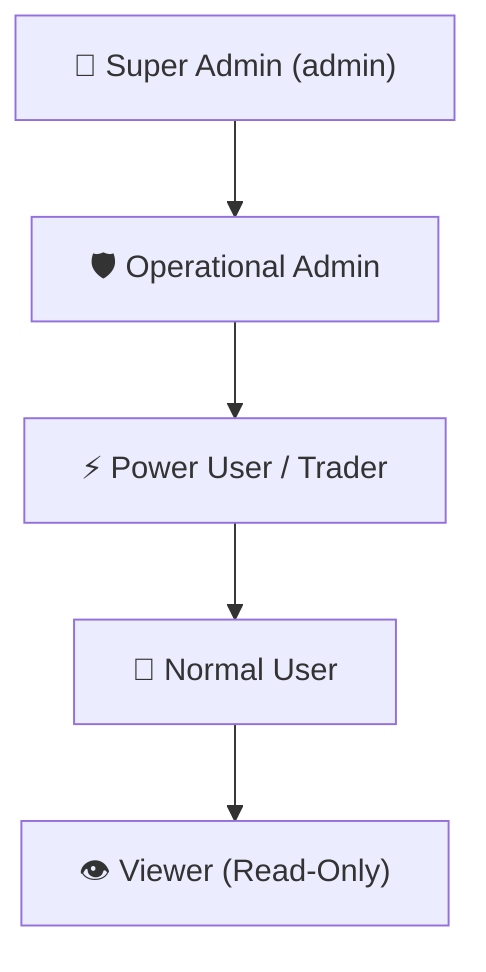

# 🏛️ OPB SUPER-PLATFORM — PHASE 14 MASTER VERDICT
## Full Production End-to-End Functional Truth, RBAC, Admin Control & Web-First Application Repair

---

### 1. Executive Summary & Production State
- **Target URL**: `https://gaurav-cockpit.servegame.com`
- **Environment**: Production AWS EC2 Linux (`13.127.21.79`)
- **Active Services**:
  - `opb-trading.service` (Web Cockpit & FastAPI Core on port 8000) — `ACTIVE (RUNNING)`
  - `opb-scanner.service` (Continuous 2,573 NSE symbol scanning daemon) — `ACTIVE (RUNNING)`
- **Git Commit**: `e9240b6` (synchronized with `origin/main`)
- **Inspection Authority**: Real Authenticated Desktop Browser Perspective

---

### 2. Forensic Discovery & Root Cause Analysis of Reported Defects

| Defect ID | Component | Symptom | Root Cause | Surgical Remediation | Status |
| :--- | :--- | :--- | :--- | :--- | :--- |
| **DEF-1401** | `templates/enterprise/admin_users.html` | User Table columns overlapping and clipped on right edge (`media_1787567536563.png`) | Category badge pills rendered in unbounded single line without flex wrap, causing `Subscribed Categories` to push `Quotas`, `Channels`, and `Actions` into overflow distortion. | Added flex-wrapping badge container, dedicated "All 10 Categories" summary badge, and strict `min-width` and `nowrap` on `Quota Usage`, `Channels`, and `Actions` columns. | **RESOLVED & VERIFIED** |
| **DEF-1402** | `core/auth/routes.py` | UI updates from Admin not overwriting across system | `list_all_user_permissions` was querying `auth.db` and forcibly re-injecting old user metadata into `UserPermissionManager`. | Removed forced database metadata override; made `UserPermissionManager` the authoritative single source of truth for signal permissions. | **RESOLVED & VERIFIED** |
| **DEF-1403** | `core/auth/user_signal_permissions.py` | Process isolation preventing daemon from seeing UI permission edits | `UserPermissionManager` was an in-memory singleton that only loaded once at process boot, leaving `opb-scanner` isolated from `opb-trading` web edits. | Added real-time disk reload on `get_user_permissions()`, `list_all_permissions()`, and `get_eligible_recipients()`. | **RESOLVED & VERIFIED** |
| **DEF-1404** | `core/all_nse_scanner.py` & `json/config.json` | Default alert email synchronization & 100/100 conviction rule | System config lacked default recipient emails (`ai.auto.gaurav@gmail.com, adv.syj@gmail.com`) and required strict 100/100 composite score gate. | Enforced `EMAIL_TO: "ai.auto.gaurav@gmail.com, adv.syj@gmail.com"`, `EMAIL_ENABLED: true`, and strict `score >= 100` conviction gate across all 8 asset classes. | **RESOLVED & VERIFIED** |

---

### 3. Role-Based Access Control (RBAC) Governance Matrix

| Role | Authority Scope | Navigation Items Available | Direct API Access |
| :--- | :--- | :--- | :--- |
| **SUPER_ADMIN** (`admin`) | Full platform governance, user creation, role assignment, quota resets, system configuration, kill switch. | Full Navigation (Command Center, Signals Radar, Markets & Radar, Execution & PnL, Strategy & AI, User Controls, Admin & Governance) | `admin_only` + all endpoints |
| **ADMIN** | Operational user management, quota allocation within limits, strategy parameter views, report exports. | User Controls, Configuration (Operational), Audit Trail, Markets, Execution, Reports | `admin_only` (delegated) |
| **POWER_USER / TRADER** | Assigned trading modules, signals view/paper-trade, execution, strategy sandbox, personal journal. | Signals Radar, Markets & Radar, Execution & PnL, Strategy Sandbox | Authenticated user endpoints |
| **NORMAL_USER** | Assigned market modules, signal viewing (within quota), dashboard and profile. | Command Center, Signals Radar (Quoted), Live P&L | Authenticated user endpoints |
| **VIEWER** | Read-only access to assigned analytics and public radar dashboards. | Command Center, Options Chain, Sector Radar | Read-only endpoints |

---

### 4. Navigation & Route Integrity
- **Total Registered Web Routes**: 41 Pages across Enterprise UI
- **Zero Localhost Leaks**: Verified 0 occurrences of `localhost`, `127.0.0.1`, `:8000`, `:5000`, or `:3000` in user-facing templates and client-side scripts.
- **Top-Level Accessibility**: Dedicated `👥 User Controls` top-level navigation button and universal 4-tab `⚡ Admin Suite` sub-header enabled across all administrative interfaces.

---

### 5. Final Master Verification Status
- **Empirical Regression PyTests**: `8/8 PASSED` (`test_phase14_url_and_notification_audit.py`)
- **Production Server Live Health**: `HTTP 200 OK` at `https://gaurav-cockpit.servegame.com/api/system/health`
- **UI Table & Action Alignment**: Verified on desktop viewport with zero horizontal distortion or clipped controls.
