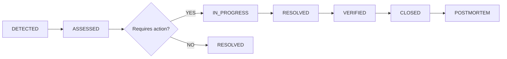
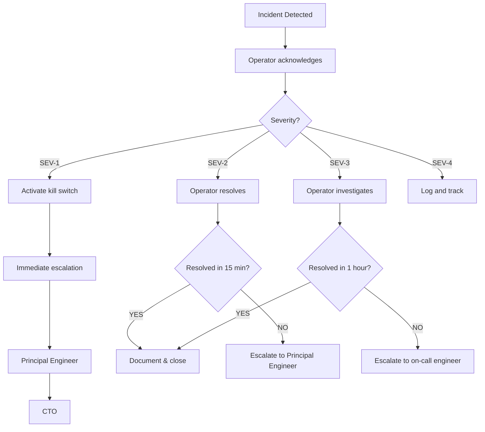

# AD-KIYU Incident Response SOP

**Document ID:** SOP-002  
**Version:** 1.0  
**Applies To:** All operators, duty engineers, escalation contacts  
**Authority:** Principal Production Validation Engineer  
**Last Updated:** 2026-05-22  

---

## 1. Incident Classification Framework

### 1.1 Severity Levels

| Severity | Impact | Response SLA | Notification | Escalation |
|----------|--------|-------------|--------------|------------|
| **SEV-1 (CRITICAL)** | Capital loss, duplicate execution, unrecoverable state | < 5 minutes | All channels + phone | Principal Engineer + CTO |
| **SEV-2 (HIGH)** | Position mismatch, reconciliation failure, kill switch failure | < 15 minutes | Operator group + escalation | Principal Engineer |
| **SEV-3 (MEDIUM)** | Config drift, stale data > 60s, non-critical invariant violation | < 1 hour | Operator group | On-call engineer |
| **SEV-4 (LOW)** | Log warning, metric anomaly, non-critical alert | < 24 hours | Logged | Next business day |
| **SEV-5 (INFO)** | Informational event | Logged | None | None |

### 1.2 Incident States



| State | Definition | Owner |
|-------|-----------|-------|
| DETECTED | Incident has been identified (alert, manual, or automated) | Automation |
| ASSESSED | Severity assigned, initial diagnosis complete | Operator |
| IN_PROGRESS | Active remediation underway | Assigned engineer |
| RESOLVED | Fix applied, monitoring for stability | Assigned engineer |
| VERIFIED | Incident verified as resolved by 2nd party | Senior Operator |
| CLOSED | Documentation complete, evidence archived | Duty Engineer |
| POSTMORTEM | Root cause analysis complete, prevention measures implemented | Principal Engineer |

---

## 2. Incident Detection

### 2.1 Detection Methods

| Method | Latency | Reliability | Examples |
|--------|---------|-------------|----------|
| Automated alert | < 1 second | HIGH | Hard halt, loss cap, reconciliation mismatch |
| Health checker | < 30 seconds | HIGH | Broker offline, DB corruption, stale feed |
| Dashboard monitor | Real-time | MEDIUM | Visual indicators, signal anomalies |
| Manual observation | Variable | LOW | Operator notices unusual behavior |
| Scheduled scan | 30-60 min | HIGH | Config drift, disk pressure, memory leak |
| Post-session review | EOD | HIGH | Missed signals, timing issues |

### 2.2 Alert Routing

```
Alert Generated
  │
  ▼
Severity Assessment (automated)
  │
  ├── SEV-1 → Telegram CRITICAL channel + SMS/Phone to Duty Engineer
  ├── SEV-2 → Telegram HIGH channel + escalation after 5 min no response
  ├── SEV-3 → Telegram WARNING channel
  └── SEV-4 → Log file + dashboard notification
```

---

## 3. Incident Response Procedures

### 3.1 General Response Workflow

```
┌─────────────────────────────┐
│  Incident DETECTED          │
└──────────────┬──────────────┘
               ▼
┌─────────────────────────────┐
│  ACKNOWLEDGE within SLA     │
│  - Respond in Telegram      │
│  - Open incident log        │
└──────────────┬──────────────┘
               ▼
┌─────────────────────────────┐
│  ASSESS severity → classify │
│  - Determine impact scope   │
│  - Check if capital at risk │
│  - Check if positions open  │
└──────────────┬──────────────┘
               ▼
┌─────────────────────────────┐
│  CONTAIN (if needed)        │
│  - Kill switch if capital   │
│    at risk                  │
│  - Freeze trading           │
│  - Isolate affected system  │
└──────────────┬──────────────┘
               ▼
┌─────────────────────────────┐
│  DIAGNOSE root cause        │
│  - Follow relevant runbook  │
│  - Check logs               │
│  - Reproduce if possible    │
└──────────────┬──────────────┘
               ▼
┌─────────────────────────────┐
│  RESOLVE                    │
│  - Apply fix                │
│  - Verify fix works         │
│  - Monitor for recurrence   │
└──────────────┬──────────────┘
               ▼
┌─────────────────────────────┐
│  VERIFY (2nd person)        │
│  - Independent verification │
│  - Confirm no side effects  │
└──────────────┬──────────────┘
               ▼
┌─────────────────────────────┐
│  CLOSE + POSTMORTEM         │
│  - Document timeline        │
│  - Root cause analysis      │
│  - Prevention measures      │
│  - Update runbooks          │
└─────────────────────────────┘
```

### 3.2 SLA Timelines

| Action | SEV-1 | SEV-2 | SEV-3 | SEV-4 |
|--------|-------|-------|-------|-------|
| Acknowledge | < 1 min | < 5 min | < 15 min | < 4 hours |
| Assess | < 3 min | < 10 min | < 30 min | < 8 hours |
| Contain | < 5 min | < 15 min | < 1 hour | N/A |
| Resolve | < 30 min | < 2 hours | < 8 hours | < 48 hours |
| Postmortem | < 24 hours | < 72 hours | < 1 week | N/A |

---

## 4. Runbook Index

### 4.1 Certified Runbooks (Phase 0 Passed)

| ID | Runbook | Severity | Last Tested |
|----|---------|----------|-------------|
| RB-001 | [Broker Outage](./runbooks/broker_outage.md) | CRITICAL | ✅ Phase 0 |
| RB-002 | [Auth Token Expiry](./runbooks/auth_expiry.md) | HIGH | ✅ Phase 0 |
| RB-003 | [DB Corruption](./runbooks/db_corruption.md) | CRITICAL | ✅ Phase 0 |
| RB-004 | [Stale Feed](./runbooks/stale_feed.md) | HIGH | ✅ Phase 0 |

### 4.2 Extended Runbooks (Required for Phase 4+)

| ID | Runbook | Severity | Status |
|----|---------|----------|--------|
| RB-005 | Network Jitter / Packet Loss | MEDIUM | 📝 Not yet written |
| RB-006 | Split Brain Detection | CRITICAL | 📝 Not yet written |
| RB-007 | Config Corruption | HIGH | 📝 Not yet written |
| RB-008 | Disk Pressure | MEDIUM | 📝 Not yet written |
| RB-009 | Simultaneous Broker Failover | CRITICAL | 📝 Not yet written |

---

## 5. Incident-Specific Procedures

### 5.1 Duplicate Order Execution (SEV-1)

**This is the most severe incident possible. Immediate action required.**

**Detection:**
- IdempotencyCertifier detects duplicate execution_id
- Broker shows two orders with same parameters
- Reconciliation reports duplicate position

**Immediate Actions:**
1. **ACTIVATE KILL SWITCH** — Stop ALL trading immediately
   ```bash
   echo "STOP_TRADING" > STOP_TRADING
   ```
2. **DO NOT** cancel any order until assessed
3. **Verify broker positions** — Log into broker portal
4. **Document both order IDs** — Capture timestamps, parameters, fills
5. **Determine if capital is at risk** — Are both positions filled?

**Resolution:**
1. If both orders filled → Broker manual intervention needed
2. If one order pending cancel → Cancel via broker portal
3. If both filled in same direction → Assess combined exposure
4. If opposite directions → May need to close one

**Escalation:**
- IMMEDIATE escalation to Principal Engineer + CTO
- ALL trading frozen until root cause identified

**Postmortem Required:**
- Root cause analysis within 24 hours
- Fix must include test proving duplicate prevention
- Recertification required (return to Phase 3 minimum)

### 5.2 Hard Halt Failure (SEV-1)

**Detection:**
- Hard halt triggered but trade continues
- Position opened despite halt state
- Dashboard shows HALT but orders still execute

**Immediate Actions:**
1. **MANUAL KILL SWITCH** — Use physical layer (broker portal)
2. **Process kill** — Kill the Python process
3. **Network block** — Block broker API access at router level
4. **Verify** — Check broker portal for any recent orders

**Escalation:**
- IMMEDIATE escalation to Principal Engineer
- System must NOT restart until root cause found

**Resolution:**
1. Identify why `_HARD_HALT` event was bypassed
2. Fix the bypass path
3. Add test that verifies halt is always honored
4. Run 5 kill switch tests before any trading resumes

### 5.3 Reconciliation Mismatch (SEV-1/SEV-2)

**Detection:**
- Reconciliation engine reports mismatch
- Local position != broker position
- Orphan order detected

**Initial Assessment:**
```bash
python -c "
from core.execution.broker_truth_reconciliation import reconcile_broker_truth
from core.wal.journal import WriteAheadJournal

# Broker truth check
report = reconcile_broker_truth()
print(f'Broker status: {report[\"status\"]} — {report[\"message\"]}')
print(f'Broker positions: {report[\"broker_positions\"]}')

# Local WAL check
wal = WriteAheadJournal('trades.db')
pending = wal.get_pending()
print(f'Local pending intents: {len(pending)}')
for p in pending:
    print(f'  - {p.intent_id}: {p.action}')
"
```

**Classification:**

| Type | Action | Severity |
|------|--------|----------|
| Local has position, broker doesn't | Mark local as STALE, investigate | HIGH |
| Broker has position, local doesn't | Create local record from broker truth | HIGH |
| Quantity mismatch | Determine correct quantity from broker | HIGH |
| Price mismatch | Trust broker price, adjust local | MEDIUM |

**Resolution:**
1. Broker truth is ALWAYS authoritative for positions
2. Update local state to match broker (with audit log)
3. Verify reconciliation passes after update
4. If mismatch persists → Manual investigation via broker portal

**Escalation:**
- If unresolved after 15 minutes → SEV-1 escalation

### 5.4 Data Feed Anomaly (SEV-2)

**Detection:**
- Stale feed alert (> 30s since last tick)
- Zero liquidity detected for > 2 minutes
- Malformed quote (price spike, negative value, NaN)

**Immediate Actions:**
1. Verify with secondary data source (yfinance as backup)
2. If stale > 60s → PAUSE trading
3. If secondary source also stale → Pause + escalate

**Resolution:**
```bash
python -c "
from core.ws_feed_manager import WsFeedManager
feed = WsFeedManager({})
feed.reconnect()
print('Feed reconnected')
"
```

**Recovery:**
1. Verify feed resumes with fresh ticks
2. Run data freshness check
3. If fresh data < 10s old → Resume trading
4. If not → Switch to backup data source

### 5.5 Config Drift (SEV-3)

**Detection:**
- Scheduled config validation detects changes
- Config hash mismatch between sessions
- Unexpected feature flag state

**Assessment:**
```bash
python -c "
from core.config_bootstrap import get_effective_config, classify_change_risk, read_recent_config_changes

# Get and validate current config
cfg = get_effective_config()
print('Config loaded successfully.')

# Check for recent changes
changes = read_recent_config_changes('config_audit.jsonl', limit=10)
if changes:
    print(f'Recent config changes ({len(changes)}):')
    for c in changes:
        risk = classify_change_risk(c.get('key', ''))
        print(f'  [{risk}] {c[\"key\"]}: {c.get(\"old_value\")} -> {c.get(\"new_value\")}')
else:
    print('No recent config changes found.')
"
```

**Resolution:**
1. Determine if config change was intentional (check audit log)
2. If unintentional → Restore from backup or defaults
3. If intentional but unauthorized → Escalate (security incident)
4. Run `python scripts/generate_config_schemas.py` if schema mismatch

### 5.6 AI Anomaly (SEV-3)

**Detection:**
- Concept drift detector fires (PSI > threshold)
- ML prediction accuracy drop > 15%
- SHAP values show unexpected feature importance shift

**Assessment:**
```bash
python -c "
from core.concept_drift_detector import detect_all_features, format_drift_report
results = detect_all_features()
print(format_drift_report(results))
n_drifted = sum(1 for r in results.values() if r.status in ('WARN', 'ALERT'))
print(f'\nDrifted features: {n_drifted}/{len(results)}')
"
```

**Resolution:**
1. If drift detected → Disable ML scoring, fall back to rule-based scoring
2. Flag model for retraining
3. Do NOT use ML predictions until retrained and validated

---

## 6. Postmortem Process

### 6.1 When Postmortem Is Required

| Condition | Always? | Timeline |
|-----------|---------|----------|
| SEV-1 incident | YES | Within 24 hours |
| SEV-2 incident | YES | Within 72 hours |
| SEV-3 incident | If recurring or unclear root cause | Within 1 week |
| Any capital loss event | YES | Within 24 hours |
| Any duplicate execution | YES (also decertification) | Within 24 hours |
| Any kill switch failure | YES | Within 24 hours |
| Any crash recovery failure | YES | Within 48 hours |

### 6.2 Postmortem Template

```markdown
## Postmortem: [Title]

**Incident ID:** INC-{YYYYMMDD}-{NNN}  
**Date:** YYYY-MM-DD  
**Severity:** SEV-{1|2|3}  
**Duration:** {duration}  
**Lead Investigator:** {name}  

### Summary
{1-2 paragraph description of what happened}

### Timeline (IST)
| Time | Event |
|------|-------|
| HH:MM | Incident detected |
| HH:MM | Incident acknowledged |
| HH:MM | Assessment complete |
| HH:MM | Containment action taken |
| HH:MM | Resolution applied |
| HH:MM | Incident verified resolved |
| HH:MM | Incident closed |

### Root Cause Analysis
{Detailed analysis of why the incident occurred}

### Impact
- **Capital impact:** {amount or "none"}
- **Trades affected:** {count}
- **Missed signals:** {count}
- **System downtime:** {duration}

### Contributing Factors
- {Factor 1}
- {Factor 2}

### What Went Well
- {Thing 1}
- {Thing 2}

### What Went Wrong
- {Thing 1}
- {Thing 2}

### Action Items
| # | Action | Owner | Due Date | Status |
|---|--------|-------|----------|--------|
| 1 | {Action} | {Owner} | {Date} | {OPEN/CLOSED} |
| 2 | {Action} | {Owner} | {Date} | {OPEN/CLOSED} |

### Prevention Measures
- {Measure 1 with verification method}
- {Measure 2 with verification method}

### Evidence Attached
- [ ] Log files
- [ ] Metrics snapshots
- [ ] Screenshots (if applicable)
- [ ] Runbook updates (if applicable)

### Sign-off
- [ ] Lead Investigator: {date}
- [ ] Principal Engineer: {date}
- [ ] CTO (if SEV-1): {date}
```

### 6.3 Action Item Tracking

| Priority | Closure Timeline | Verification |
|----------|-----------------|--------------|
| P0 (CRITICAL) | < 24 hours | Test proves fix works |
| P1 (HIGH) | < 72 hours | Code review + test |
| P2 (MEDIUM) | < 2 weeks | Code review |
| P3 (LOW) | < 1 month | Task tracking |

---

## 7. Communication Templates

### 7.1 Alert Messages

**SEV-1 Alert (Telegram):**
```
🔥 CRITICAL: {incident_type}
System: AD-KIYU
Time: {HH:MM IST}
Impact: {description}
Action: {immediate_action_required}
Respond: @{on_call_engineer}
```

**SEV-2 Alert:**
```
🚨 HIGH: {incident_type}
System: AD-KIYU
Time: {HH:MM IST}
Impact: {description}
Action: {required_action}
```

**SEV-3 Alert:**
```
⚠️ WARNING: {incident_type}
System: AD-KIYU
Time: {HH:MM IST}
Details: {description}
```

### 7.2 Status Update Template (for ongoing incidents)

```
Status Update: INC-{ID} — {incident_type}
Time: {HH:MM IST}
State: {IN_PROGRESS|RESOLVED|VERIFIED}
Progress: {what has been done}
Next steps: {what still needs to be done}
ETA: {estimated resolution time}
```

### 7.3 Incident Closure Notification

```
✅ Incident Closed: INC-{ID}
Type: {incident_type}
Duration: {duration}
Root cause: {summary}
Capital impact: {amount or "none"}
Postmortem: {link to document}
Prevention: {summary of measures}
```

---

## 8. Escalation Tree



---

## 9. Recovery Verification

### 9.1 Post-Incident Verification Checklist

After any incident is resolved, the following MUST be verified before resuming trading:

- [ ] All positions reconciled with broker truth
- [ ] No PENDING intents in WAL journal
- [ ] Safety invariants all GREEN
- [ ] Kill switch test passes
- [ ] Broker connectivity verified
- [ ] Data freshness verified
- [ ] Risk limits verified
- [ ] Config validation passes
- [ ] Health checker reports GREEN

### 9.2 Resumption Protocol

1. Only designated operator can authorize resumption
2. Must confirm all items in Section 9.1 checklist
3. First 15 minutes after resumption: enhanced monitoring
4. If same incident recurs within 30 minutes → freeze until root cause fixed

---

## 10. Continuous Improvement

### 10.1 Incident Review Cadence

| Review Type | Frequency | Participants |
|-------------|-----------|-------------|
| Weekly incident review | Weekly | All operators + duty engineer |
| SEV-1/2 postmortem review | Per incident | Principal Engineer + involved parties |
| Quarterly trend analysis | Quarterly | Principal Engineer + CTO |
| Runbook update review | Monthly or per incident | Duty Engineer |

### 10.2 Metrics & KPIs

| Metric | Target | Warning | Critical |
|--------|--------|---------|----------|
| Incident response time (SEV-1) | < 1 min | 3-5 min | > 5 min |
| Incident resolution time (SEV-1) | < 15 min | 15-30 min | > 30 min |
| Incident response time (SEV-2) | < 5 min | 5-10 min | > 15 min |
| Weekly SEV-1 count | 0 | 1 | 2+ |
| Weekly SEV-2 count | 0 | 2 | 5+ |
| Postmortem completion rate | 100% | 80% | < 80% |
| Action item closure rate (P0) | 100% in 24h | 80% | < 80% |

### 10.3 Runbook Maintenance

- Runbooks must be tested at least once per phase
- Runbooks must be updated after any related incident
- Runbooks must be reviewed quarterly for accuracy
- New chaos scenarios must generate new runbooks

---

*End of Incident Response SOP — AD-KIYU v2.53*  
*This SOP must be reviewed and updated after any SEV-1 or SEV-2 incident.*
