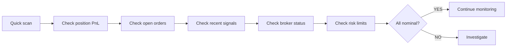

# AD-KIYU Live Dashboard Monitoring Checklist

**Document ID:** CHK-001  
**Version:** 1.0  
**Purpose:** Ensure dashboard accuracy, completeness, and real-time correctness during live trading sessions  
**Applies To:** All operators during live monitoring  
**Last Updated:** 2026-05-22  

---

## 1. Dashboard Overview

### 1.1 Dashboard Endpoints

The AD-KIYU dashboard is served via the Admin Control Plane (FastAPI, port 8765 by default):

| Endpoint | Purpose | Refresh Rate |
|----------|---------|-------------|
| `/` | Main dashboard | Auto-refresh 2s |
| `/health` | System health status | Auto-refresh 30s |
| `/state` | System state & mode | Auto-refresh 2s |
| `/trades` | Trade history | Auto-refresh 10s |
| `/signals` | Live signal feed | Auto-refresh 2s |
| `/positions` | Current open positions | Auto-refresh 2s |
| `/metrics` | Prometheus metrics | Static |
| `/control/*` | Admin controls | Manual |

### 1.2 Pre-Session Validation

Before each session, verify ALL dashboard endpoints are responsive:

```bash
# Set auth token (must match web_dashboard_auth_token in config)
TOKEN="your-auth-token-here"

# Quick endpoint health check
curl -s -o /dev/null -w "%{http_code}" http://localhost:8765/health -H "Authorization: Bearer $TOKEN"
curl -s -o /dev/null -w "%{http_code}" http://localhost:8765/state -H "Authorization: Bearer $TOKEN"
curl -s -o /dev/null -w "%{http_code}" http://localhost:8765/signals -H "Authorization: Bearer $TOKEN"
```

| Endpoint | Expected Status | Pass? |
|----------|----------------|-------|
| `/health` | 200 | ☐ |
| `/state` | 200 | ☐ |
| `/signals` | 200 | ☐ |
| `/positions` | 200 | ☐ |
| `/trades` | 200 | ☐ |

---

## 2. Dashboard Sections — Verification Matrix

### 2.1 System Status Bar

**Location:** Top of dashboard  
**Displays:** Execution mode, broker status, hard halt status, session timer

| Check | Expected | Action if Wrong |
|-------|----------|----------------|
| Execution mode matches configured mode | SIGNAL_ONLY / SHADOW / LIVE_MANUAL_CONFIRM / FULL_AUTO | Stop session, check config |
| Broker status correct | ONLINE / OFFLINE / DEGRADED | Check broker connectivity |
| Hard halt indicator | GREEN (no halt) or RED (halted) | If RED but system still trading → KILL SWITCH |
| Session timer counting up | 09:15 → 15:30 IST | Check system clock vs IST |
| Current phase displayed | Phase X | Verify against certification plan |

**Daily verification:** ☐ All status indicators correct

### 2.2 Position Panel

**Location:** Left side, top  
**Displays:** Open positions, entry price, current price, PnL, quantity

| Check | Expected | Action if Wrong |
|-------|----------|----------------|
| Position count matches broker | Match exactly | Run reconciliation |
| Entry price matches broker confirmation | Within 0.1% | Check broker fill report |
| Current price matches market data | Within 0.2% | Check data feed freshness |
| PnL calculation | Matches (current - entry) × qty | Manual calculation check |
| Overnight positions (if any) | Correctly shown from DB | Check reconciliation |
| Zero positions at close | All closed by 15:30 | Verify broker portal |

**Daily verification:** ☐ Position panel matches broker truth

### 2.3 Signal Feed

**Location:** Center panel  
**Displays:** Live signal cards with score, direction, index, timestamp, action buttons

| Check | Expected | Action if Wrong |
|-------|----------|----------------|
| Timestamp is current | Within last 5 seconds | Check data feed |
| Score in valid range [0, 1] | 0.0–1.0 | Check signal pipeline |
| Direction matches market regime | CALL in uptrend, PUT in downtrend | Manual market assessment |
| Index matches configured instruments | NIFTY/BANKNIFTY/FINNIFTY | Check config |
| Score threshold filter applied | Only scores ≥ threshold shown | Verify threshold config |
| Signal frequency reasonable | ≤ 1 per 2 minutes per index | Check for signal flapping |
| Confirm button works (Phase 3+) | Order submitted | Manual test |
| Reject button works (Phase 3+) | Signal rejected | Manual test |
| Expiry session correctly labeled | MORNING / MIDDAY / CAUTION / BLOCKED | Check session classification |

**Daily verification:** ☐ Signal feed accurate and responsive

### 2.4 Market Data Panel

**Location:** Right side  
**Displays:** Live quotes for NIFTY, BANKNIFTY, FINNIFTY, VIX, PCR

| Check | Expected | Action if Wrong |
|-------|----------|----------------|
| NIFTY LTP | Within 0.2% of broker/trading view source | Cross-reference |
| BANKNIFTY LTP | Within 0.2% of reference | Cross-reference |
| FINNIFTY LTP | Within 0.2% of reference | Cross-reference |
| VIX value | Positive number, 10-40 range typical | Check NSE VIX |
| PCR value | Positive decimal, 0.5-1.5 typical | Check NSE PCR |
| Last update timestamp | < 5 seconds ago | Feed freshness check |
| Price movement smooth | No sudden spikes > 2% | Check for quote anomalies |

**Daily verification:** ☐ Market data panel accurate and current

### 2.5 Health Status Panel

**Location:** Bottom or sidebar  
**Displays:** System health metrics, DB status, ML status, broker health

| Check | Expected | Action if Wrong |
|-------|----------|----------------|
| All DBs: trades, journal, ml, oi | GREEN | Run health checker |
| Disk space | > 10% free | Cleanup scheduler |
| Memory usage | < 80% | Check for leaks |
| ML model loaded | YES | Check ml_classifier |
| Feature drift | NO (GREEN) | Check concept drift detector |
| WAL integrity | INTACT | Check WAL journal |

**Daily verification:** ☐ Health status all GREEN

### 2.6 Risk Limits Panel

**Location:** Bottom or sidebar  
**Displays:** Daily PnL, daily loss remaining, weekly PnL, drawdown, open risk

| Check | Expected | Action if Wrong |
|-------|----------|----------------|
| Daily PnL correct | Matches position panel × mark-to-market | Manual calculation |
| Daily loss remaining | Budget - used | Verify against config |
| Weekly PnL correct | Sum of daily PnLs | Manual calculation |
| Drawdown from peak | % of starting capital | Verify |
| Open risk amount | Sum of all position risks | Manual calculation |
| Daily loss remaining > 0 | Positive until cap hit | If zero → system should be halted |
| All risk limits respected | None flashing RED | If RED → verify halt active |

**Daily verification:** ☐ Risk limits panel accurate

### 2.7 Alerts Panel

**Location:** Bottom  
**Displays:** Recent alerts with severity, timestamp, message

| Check | Expected | Action if Wrong |
|-------|----------|----------------|
| Alert timestamp current | Within last minute | Check alert system |
| Severity classification correct | CRITICAL/HIGH/WARNING/INFO | Verify against classification |
| No unacknowledged CRITICAL alerts | 0 | Must acknowledge immediately |
| Alert deduplication working | No repeat same alert < 30s | Check alert system |
| Alert history scrollable | Yes | Manual test |

**Daily verification:** ☐ Alert panel accurate

### 2.8 Controls Panel

**Location:** Top or sidebar  
**Displays:** Execute mode, pause/resume/halt buttons, config controls

| Check | Expected | Action if Wrong |
|-------|----------|----------------|
| Pause button works | Trading pauses | Manual test each session |
| Resume button works | Trading resumes | Manual test each session |
| Emergency Halt button works | Immediate stop | Manual test each session |
| Mode change controls RBAC-protected | Unauthorized blocked | Manual test |
| Config change audit-logged | All changes recorded | Check audit log |

**Daily verification:** ☐ Controls panel fully functional

---

## 3. Real-Time Validation Tests

### 3.1 Every 15 Minutes — Quick Scan (~30 seconds)



| Check | Action |
|-------|--------|
| Position PnL within expected range | If unusual, investigate |
| No orders stuck > 60 seconds | If stuck, investigate broker |
| Recent signals look reasonable | If nonsense, check market data |
| Broker status still ONLINE | If DEGRADED/OFFLINE, investigate |
| Risk limits not approaching thresholds | If approaching, prepare for halt |

### 3.2 Every 30 Minutes — Medium Scan (~60 seconds)

| Check | Action |
|-------|--------|
| Run quick health check | `python -m core.health_checker --format json` |
| Check data freshness | `python -c "from core.data_freshness_guard import check_data_freshness; r=check_data_freshness(); print(\"PASS\" if r.passed else \"STALE: \"+r.reject_reason)"` |
| Verify reconciliation | `python -c "from core.execution.broker_truth_reconciliation import reconcile_broker_truth; print(reconcile_broker_truth())"` |
| Check for any stale PENDING intents | WAL journal check |
| Verify log output not excessive | Log file size check |

### 3.3 Every Hour — Full Scan (~3 minutes)

| Check | Action |
|-------|--------|
| Full health check | `python -m core.health_checker --format json` |
| Memory usage | Task manager |
| Disk space | `python -c "import shutil; t,u,f=shutil.disk_usage('.'); print(f'{f//(1024**2)} MB free')"` |
| Thread count | `python -c "import threading; print(threading.active_count())"` |
| DB file sizes | Check for abnormal growth |
| ML prediction drift check | `python -c "from core.concept_drift_detector import detect_all_features, format_drift_report; print(format_drift_report(detect_all_features()))"` |

---

## 4. Phase-Specific Dashboard Checks

### 4.1 Phase 1 — SIGNAL_ONLY

| Check | Frequency | 
|-------|-----------|
| Signals are generated but NO orders placed | Continuous |
| Signal quality vs market conditions | EOD review |
| No order confirmation buttons visible | Pre-session |
| Dashboard clearly shows SIGNAL_ONLY mode | Continuous |

### 4.2 Phase 2 — SHADOW MODE

| Check | Frequency |
|-------|-----------|
| Paper fill simulation running alongside signals | Continuous |
| Simulated PnL tracked separately from capital | Continuous |
| Entry price realism acceptable | Each signal |
| Exit price realism acceptable | Each exit |
| No paper order accidentally goes live | Continuous |

### 4.3 Phase 3 — LIVE MANUAL CONFIRM

| Check | Frequency |
|-------|-----------|
| Confirm button visible and functional | Continuous |
| Reject button visible and functional | Continuous |
| Operator actions are logged to audit trail | Continuous |
| No automatic execution bypasses operator | Continuous |
| Kill switch accessible and tested | Pre-session + EOD |

### 4.4 Phase 4 — MICRO CAPITAL AUTO

| Check | Frequency |
|-------|-----------|
| Capital cap applied correctly | Pre-session |
| Max position limit = 1 | Pre-session |
| Daily loss cap = 0.5% | Pre-session |
| All auto-executions logged to audit | Continuous |
| Idempotency verified per order | Each order |
| Broker confirmation matches local | Each order |

### 4.5 Phase 5 — CONTROLLED CAPITAL AUTO

| Check | Frequency |
|-------|-----------|
| Capital limits within Phase 5 thresholds | Pre-session |
| Max positions = 3 | Continuous |
| VIX-based sizing active | Each trade |
| Correlation guard active | Each entry |
| Expiry session enforcement | Expiry days |

### 4.6 Phase 6 — FULL AUTO

| Check | Frequency |
|-------|-----------|
| All Phase 5 checks | As Phase 5 |
| Full capital deployment monitored | Continuous |
| All protective controls verified active | Pre-session |
| Emergency drills completed | Weekly |

---

## 5. Dashboard Anomaly Reference

### 5.1 Red Flags — Investigate Immediately

| Anomaly | Likely Cause | Action |
|---------|-------------|--------|
| Price display frozen > 10 seconds | Data feed issue | Check WebSocket, check yfinance fallback |
| PnL flash > 5% in seconds | Wrong mark-to-market price | Check current price feed |
| Signal score = exactly 0.5 | ML model not predicting | Check ML classifier health |
| Signal flapping (same index, opposite direction < 30s) | Market regime noise / bad data | Investigate, consider pause |
| Position count mismatch vs broker | Reconciliation issue | Run reconciliation |
| HALT indicator not showing when expected | Safety engine issue | Manual kill switch |
| Memory > 90% | Potential leak | Plan restart at session end |

### 5.2 Yellow Flags — Monitor Closely

| Anomaly | Likely Cause | Action |
|---------|-------------|--------|
| Signal count > 10 per hour per index | Overly sensitive model | Check signal thresholds |
| Open orders > 2 minutes without fill | Liquidity issue | Consider reducing position size |
| Broker response time > 2 seconds | Network latency | Monitor, switch backup if persists |
| CPU usage > 80% | Heavy computation | Check for runaway process |
| Log file growing > 10 MB/hour | Excessive logging | Check log level config |

### 5.3 Green Flags — All Normal

| Signal | Meaning |
|--------|---------|
| All DBs GREEN | Storage healthy |
| Broker ONLINE | Connectivity nominal |
| Data freshness < 5s | Market data current |
| Risk limits all within threshold | Capital preserved |
| Reconciliations passing | State consistent |
| ML predictions active | Feature pipeline healthy |
| Alert panel quiet | No anomalies |

---

## 6. End-of-Session Dashboard Verification

### 6.1 Session Close Checks

After market close (15:30 IST), verify the following from the dashboard:

- [ ] All positions show CLOSED (PnL captured)
- [ ] No open orders remaining
- [ ] Signal feed stopped generating new signals
- [ ] Final session PnL displayed
- [ ] Trade count matches expected
- [ ] Win rate displayed
- [ ] All alert indicators reset
- [ ] Dashboard state matches post-session expectation

### 6.2 Session Summary Capture

At session end, capture the following for certification evidence:

1. **Dashboard screenshot** (full page)
2. **Health check output** (JSON)
   ```bash
   python -m core.health_checker --format json > reports/sessions/{date}/health_{date}.json
   ```
3. **Session signal log**
   ```bash
   TOKEN="your-auth-token-here"
   curl -s http://localhost:8765/signals -H "Authorization: Bearer $TOKEN" > reports/sessions/{date}/signals_{date}.json
   ```
4. **Trade log**
   ```bash
   TOKEN="your-auth-token-here"
   curl -s http://localhost:8765/trades -H "Authorization: Bearer $TOKEN" > reports/sessions/{date}/trades_{date}.json
   ```
5. **Key metrics snapshot**
   ```bash
   TOKEN="your-auth-token-here"
   curl -s http://localhost:8765/metrics -H "Authorization: Bearer $TOKEN" > reports/sessions/{date}/metrics_{date}.txt
   ```

### 6.3 Overnight Checks

- [ ] Bot shut down gracefully (if not 24/7 mode)
- [ ] All databases safely closed
- [ ] Session logs archived
- [ ] Dashboard accessible (for review)

---

## 7. Checklist Summary Sheet

### Operator Daily Checklist Sheet

```markdown
# AD-KIYU Operator Daily Checklist
**Date:** ______________  **Operator:** ______________  **Phase:** ______________

## PRE-SESSION (08:45-09:15 IST)
- [ ] System health check — ALL GREEN
- [ ] Broker connectivity — ONLINE
- [ ] Data feed freshness — < 10s
- [ ] Position reconciliation — 0 mismatches
- [ ] Config validation — PASS
- [ ] Kill switch test — PASS
- [ ] Dashboard endpoints — ALL RESPONSIVE
- [ ] Risk limits set for current phase
- [ ] Execution mode correct for phase

**GO/NO-GO:** ☐ GO  ☐ NO-GO (reason: ______________)

## DURING SESSION
### 09:15 — Session Start
- [ ] Session timer started
- [ ] First signals normal
- [ ] Dashboard all green

### 10:00 — Check
- [ ] All indicators nominal
- [ ] No alerts pending

### 11:00 — Check
- [ ] Position PnL normal
- [ ] Data feed fresh

### 12:00 — Midday Check
- [ ] All well
- [ ] Risk limits respected

### 13:00 — Check
- [ ] Expiry gate status correct (if expiry day)

### 14:00 — Check
- [ ] Late session behavior correct

### 15:00 — Final Entry Window
- [ ] New entries blocked (per config)
- [ ] Positions closing normally

## POST-SESSION (15:30+)
- [ ] All positions closed
- [ ] Final reconciliation — 0 mismatches
- [ ] Session summary generated
- [ ] Dashboard screenshots saved
- [ ] Session log archived
- [ ] Operator notes recorded
- [ ] Evidence captured for certification

## INCIDENTS
| Time | Type | Severity | Resolved? | Notes |
|------|------|----------|-----------|-------|
|      |      |          |           |       |
|      |      |          |           |       |
|      |      |          |           |       |

## OPERATOR SIGN-OFF
**Signature:** __________________  **Date:** __________________
```

---

*End of Live Dashboard Checklist — AD-KIYU v2.53*  
*Print this checklist for each session or use the digital version in your monitoring station.*
