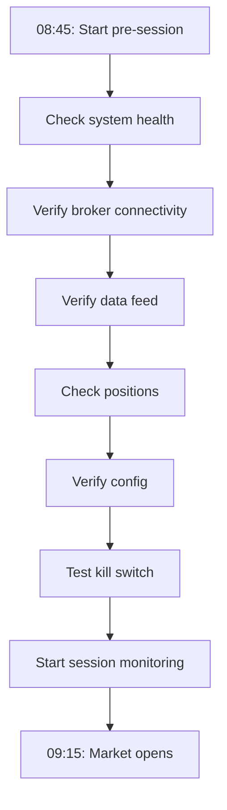
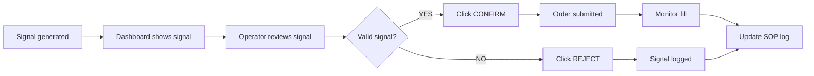

# AD-KIYU Operator Standard Operating Procedure (SOP)

**Document ID:** SOP-001  
**Version:** 1.0  
**Applies To:** All AD-KIYU operators (human-in-loop roles)  
**Authority:** Principal Production Validation Engineer  
**Last Updated:** 2026-05-22  

---

## 1. Operator Roles & Responsibilities

### 1.1 Role Definitions

| Role | Authority | Training Required | Shift |
|------|-----------|-------------------|-------|
| **Trading Operator** | Monitor, confirm/reject signals, emergency halt | Phase 3 certification | Per session |
| **Senior Operator** | Config changes, broker failover, override | Phase 3 + 5 supervised sessions | Per session |
| **Duty Engineer** | System restart, DB recovery, escalation | Full system training | On-call |
| **Principal Engineer** | Phase transitions, capital expansion, incident review | N/A | Escalation only |

### 1.2 Operator Responsibilities

1. **Session readiness** — Verify system health before market open
2. **Continuous monitoring** — Observe dashboard during trading hours
3. **Signal response** — Confirm/reject signals within 10 seconds (Phase 3)
4. **Incident response** — Execute runbook procedures when alerts fire
5. **Session close** — Verify EOD state, log session summary
6. **Escalation** — Report anomalies beyond SOP scope

### 1.3 Prohibited Actions

| Action | Risk | Consequence |
|--------|------|-------------|
| Bypass kill switch in emergency | Capital loss | Immediate decertification |
| Modify risk parameters during live session | Uncontrolled risk | Immediate decertification |
| Execute trades outside system recommendation | Unvalidated risk | Immediate decertification |
| Share credentials or tokens | Security breach | Immediate decertification |
| Silence alerts without investigation | Missed critical events | Written warning |
| Leave session unattended > 15 min | Missed signals/incidents | Written warning |
| Bypass RBAC via direct DB manipulation | Audit integrity failure | Immediate termination |

---

## 2. Pre-Session Procedures

### 2.1 Morning Checklist (T-30 minutes before market open: 08:45 IST)



#### Step 1: System Health Check
Run the comprehensive health checker:
```bash
python -m core.health_checker --format json
```

**Verify:**
- [ ] All DBs accessible (trades.db, trade_journal.db, ml_tracker.db, oi_snapshots.db)
- [ ] Disk space > 10% free
- [ ] Memory usage < 80%
- [ ] Log directory not exceeding 500 MB
- [ ] All worker threads alive

#### Step 2: Broker Connectivity
```bash
python -m core.health_checker --format json | python -c "import sys,json; d=json.load(sys.stdin); print(json.dumps(d.get('broker',{}),indent=2))"
```

**Verify:**
- [ ] Active broker status = ONLINE
- [ ] Auth token valid (not expiring within 2 hours)
- [ ] Backup broker reachable (if configured)
- [ ] Broker API response time < 1s

#### Step 3: Data Feed Verification
```bash
python -c "
from core.data_freshness_guard import check_data_freshness
result = check_data_freshness()
print(f'Data freshness: {\"PASS\" if result.passed else \"FAIL: \" + result.reject_reason}')
"
```

**Verify:**
- [ ] NIFTY quote age < 10 seconds
- [ ] BANKNIFTY quote age < 10 seconds
- [ ] FINNIFTY quote age < 10 seconds
- [ ] VIX data present
- [ ] No stale feed warnings

#### Step 4: Overnight Position Reconciliation
```bash
python -c "
from core.wal.journal import WriteAheadJournal
from core.execution.idempotency.certifier import IdempotencyCertifier

# Check WAL for pending intents
wal = WriteAheadJournal('trades.db')
pending = wal.get_pending()
print(f'Pending WAL intents: {len(pending)}')
for p in pending:
    print(f'  - {p.intent_id}: {p.action}')

# Check certifier for non-terminal executions
cert = IdempotencyCertifier('trades.db')
counts = cert.count_by_status()
print(f'Certifier status: {counts}')

# Check broker truth (if broker initialized)
try:
    from core.execution.broker_truth_reconciliation import reconcile_broker_truth
    report = reconcile_broker_truth()
    print(f'Broker reconciliation: {report[\"status\"]} — {report[\"message\"]}')
except Exception as e:
    print(f'Broker reconciliation skipped: {e}')
"
```

**Verify:**
- [ ] WAL journal has 0 PENDING intents
- [ ] Certifier has 0 PENDING status
- [ ] Broker positions match expectations (if broker connected)
- [ ] No stale PENDING intents
- [ ] PnL from previous session matches expected

#### Step 5: Configuration Verification
```bash
python -c "
from core.config_bootstrap import get_effective_config, classify_change_risk
from core.environment import validate_environment

cfg = get_effective_config()
print(f'Execution mode: {cfg.get(\"EXECUTION_MODE\", \"SIGNAL_ONLY\")}')
print(f'Max daily loss: {cfg.get(\"MAX_DAILY_LOSS\", 0)}')
print(f'Base capital: {cfg.get(\"BASE_CAPITAL\", 0)}')
print(f'AI threshold: {cfg.get(\"AI_THRESHOLD\", 60)}')

# Validate environment
env = validate_environment(cfg)
print(f'Environment: {env.value}')
"
```

**Verify:**
- [ ] Execution mode matches planned phase
- [ ] All risk limits are correct for current phase
- [ ] Feature flags match expected state
- [ ] No unexpected config drift

#### Step 6: Kill Switch Test
```bash
# Test hard halt via safety_state API
python -c "
from core.safety_state import trip_hard_halt, clear_hard_halt, is_hard_halted, hard_halt_reason

# Ensure clear state
clear_hard_halt()
assert not is_hard_halted(), 'HALT should be clear before test'

# Trip the halt
reason = 'pre-session kill switch test'
trip_hard_halt(reason)
assert is_hard_halted(), 'HALT should be active after trip'
print(f'Kill switch activation: PASS (reason: {hard_halt_reason()})')

# Clear for session
clear_hard_halt()
assert not is_hard_halted(), 'HALT should clear for session'
print('Kill switch reset: PASS')
print('Kill switch test: PASS')
"
```

**Verify:**
- [ ] Hard halt can be activated and detected via API
- [ ] Dashboard shows correct halt state (RED when halted, GREEN when cleared)
- [ ] Hard halt blocks simulated entry (verify via admin CP)

### 2.2 Morning Go/No-Go Decision

| Condition | Go | No-Go |
|-----------|----|-------|
| Pre-session checklist | 100% passing | Any failure |
| Broker connectivity | Online | Offline/unreachable |
| Data freshness | All indices fresh | Any stale > 30s |
| Overnight reconciliation | 0 mismatches | Any mismatch unresolvable |
| Kill switch test | PASS | FAIL |
| **Decision** | **Proceed** | **Do not trade** |

**No-Go actions:**
1. Log issue in incident tracker
2. Escalate to Duty Engineer
3. Do NOT start trading session
4. If issue resolved before 10:00 IST, re-run checklist
5. If not resolved by 10:00 IST, cancel session

---

## 3. During-Session Procedures

### 3.1 Monitoring Cadence

| Interval | Action | Duration |
|----------|--------|----------|
| Continuous | Watch dashboard for signals, alerts | Always |
| Every 5 minutes | Quick glance at dashboard status | 10 seconds |
| Every 15 minutes | Check position PnL, open orders | 30 seconds |
| Every 30 minutes | Broker health check | 15 seconds |
| Every hour | Full system health scan | 60 seconds |

### 3.2 Signal Response Workflow (Phase 3: LIVE_MANUAL_CONFIRM)



**Signal review criteria:**
- Signal score > configured threshold (default: 0.65)
- Direction (CALL/PUT) consistent with market regime
- Strike selection within acceptable delta range
- No contradictory signals from other indices
- No open position in same index
- No hard halt or pause active

**Confirm procedure:**
1. Visually verify signal details on dashboard
2. Click "Confirm" within 10 seconds of signal appearance
3. Confirm order appears in "Open Orders" section
4. Monitor fill status — if not filled within 30 seconds, investigate

**Reject procedure:**
1. Click "Reject"
2. Enter rejection reason in dialog box
3. Log in session notes

### 3.3 Alert Response Matrix

| Alert | Severity | Sound | Response SLA |
|-------|----------|-------|-------------|
| Hard halt triggered | CRITICAL | Continuous alarm | Immediate (< 5s) |
| Daily loss cap approaching (80%) | HIGH | Pulse alarm | < 30s |
| Reconciliation mismatch | HIGH | Pulse alarm | < 30s |
| Stale data detected | HIGH | Pulse alarm | < 30s |
| Broker disconnected | CRITICAL | Continuous alarm | Immediate (< 5s) |
| New signal generated | INFO | Soft chime | < 10s |
| Position filled | INFO | Soft chime | < 10s |
| Position closed | INFO | Soft chime | < 15s |
| Config changed | WARNING | Soft chime | < 60s |
| AI anomaly detected | WARNING | Soft chime | < 60s |

### 3.4 Position Monitoring

| Check | Frequency | Expected | Action if Violated |
|-------|-----------|----------|--------------------|
| Open positions count | Each fill | ≤ max configured | Do not enter new trades |
| Position PnL | Continuously | Within SL/Target | Monitor, auto-exit at SL/Target |
| Time in position | Each minute | ≤ 60 min (configurable) | Auto-exit at max hold time |
| Index correlation | Each new signal | No conflict | Block if correlation conflict |
| Expiry session gate | Each entry attempt | Correct gate status | Block if outside allowed session |

### 3.5 Break Monitoring (Operator Breaks)

| Break Type | Duration | Coverage Required | Procedure |
|------------|----------|-------------------|-----------|
| Short break | < 5 minutes | None (auto-pilot OK) | Inform second operator |
| Lunch break | < 30 minutes | Second operator must cover | Handover + brief |
| Emergency | Any | Full handover to relief operator | Documented handover |

**During operator absence:**
- System continues in its current mode (no automatic mode change without operator)
- Alerts escalate to Duty Engineer if no response within 2 minutes
- All signals are automatically rejected during prolonged absence (> 15 min)

---

## 4. End-of-Session Procedures

### 4.1 Session Close (15:30 IST)

#### Step 1: Position Verification
- [ ] All positions closed (no overnight holdings expected for day trading)
- [ ] Broker confirmation matches local records
- [ ] PnL calculated matches expectation

#### Step 2: Reconciliation
```bash
python -c "
from core.reconciliation_engine import ReconciliationEngine
from core.execution.broker_truth_reconciliation import reconcile_broker_truth
from core.wal.journal import WriteAheadJournal
from core.execution.idempotency.certifier import IdempotencyCertifier

# Broker truth check
report = reconcile_broker_truth()
print(f'Broker reconciliation: {report[\"status\"]} — {report[\"message\"]}')

# WAL check for any pending intents
wal = WriteAheadJournal('trades.db')
pending = wal.get_pending()
print(f'WAL pending intents: {len(pending)}')
for p in pending:
    print(f'  - {p.intent_id}: {p.action}')

# Certifier final check
cert = IdempotencyCertifier('trades.db')
counts = cert.count_by_status()
print(f'Final certifier status: {counts}')
"
```

**Verify:**
- [ ] All orders reconciled (PENDING/COMMITTED → SETTLED/FAILED)
- [ ] No open intents in WAL journal
- [ ] Broker positions = 0 (all closed)

#### Step 3: Session Summary
```bash
python -c "
from core.session_report import DailySessionReporter
reporter = DailySessionReporter(db_path='trades.db')
report = reporter.generate_report()
print(f'Trades: {report.trades.total_trades} ({report.trades.winning_trades}W / {report.trades.losing_trades}L)')
print(f'Win rate: {report.win_rate:.1f}%')
print(f'PnL: {report.pnl.total_pnl:+.2f} (realized: {report.pnl.realized_pnl:+.2f})')
print(f'Max drawdown: {report.risk.max_drawdown:.2f}')
"
```

**Review:**
- [ ] Number of signals generated
- [ ] Number of trades executed
- [ ] Win rate
- [ ] PnL
- [ ] Any incidents

#### Step 4: Log Archival
- [ ] Session logs archived to `logs/sessions/{date}/`
- [ ] Session summary saved to `reports/sessions/{date}/`

#### Step 5: Generate EOD Report
```bash
python -m core.report_generator --days 1 --mode PAPER
```

#### Step 6: Post-Session Notes
- [ ] Record any anomalies or observations
- [ ] Note any signals that should have fired but didn't
- [ ] Note any false signals
- [ ] Submit session log for certification evidence

### 4.2 Weekend Close (Friday EOD, if applicable)

- [ ] Full weekly reconciliation
- [ ] Generate weekly performance report
- [ ] Backup all databases
- [ ] Run `python -m core.health_checker`
- [ ] If in Phase 1+, increment certification session counter

---

## 5. Emergency Procedures

### 5.1 Kill Switch Activation

**Immediate action when any of these occur:**
- Unexpected PnL swing > 2%
- Duplicate order detected in broker
- Broker API behaving erratically
- System behaving erratically (signals don't match market)
- Any safety invariant violation alert

**Method 1: Dashboard Button**
1. Click "Emergency Halt" button on dashboard
2. Confirm dialog
3. Verify "HALT" status indicator is RED

**Method 2: API Call**
```bash
# Replace TOKEN with actual web_dashboard_auth_token
TOKEN="your-auth-token-here"
curl -X POST http://localhost:8765/control/halt \
  -H "Authorization: Bearer $TOKEN"
```

**Method 3: Kill File**
```bash
echo "STOP_TRADING" > STOP_TRADING
```

**Method 4: Telegram**
Send `/halt` command to the bot.

**After activation:**
- [ ] Verify no new orders placed
- [ ] Monitor existing positions (allow to close naturally)
- [ ] Document reason for halt
- [ ] Do NOT resume until root cause identified

### 5.2 System Restart Procedure

Only when no open positions exist:

1. **Graceful shutdown:**
   ```bash
   python -c "from index_app.index_trader_interface import shutdown; shutdown()"
   ```

2. **Verify all positions closed:**
   ```bash
   python -c "
   from core.execution.broker_truth_reconciliation import reconcile_broker_truth
   report = reconcile_broker_truth()
   print(f'Status: {report[\"status\"]}')
   print(f'Broker positions: {report[\"broker_positions\"]}')
   print(f'Message: {report[\"message\"]}')
   "
   ```

3. **Restart system:**
   ```bash
   python index_app/index_trader.py --paper
   ```

4. **Verify recovery:**
   ```bash
   python -m core.health_checker
   ```

### 5.3 Crash Recovery (Ungraceful Shutdown)

1. **Check for open positions:**
   ```bash
   python -c "
   from core.wal.journal import WriteAheadJournal
   wal = WriteAheadJournal('trades.db')
   pending = wal.get_pending()
   print(f'Pending intents: {len(pending)}')
   for p in pending:
       print(f'  - {p.intent_id}: {p.action} {p.params}')
   
   from core.execution.idempotency.certifier import IdempotencyCertifier
   cert = IdempotencyCertifier('trades.db')
   counts = cert.count_by_status()
   print(f'Certifier status: {counts}')
   "
   ```

2. **Reconcile with broker:**
   ```bash
   python -c "
   from core.execution.broker_truth_reconciliation import reconcile_broker_truth
   report = reconcile_broker_truth()
   print(f'Broker report: {report[\"status\"]} — {report[\"message\"]}')
   "
   ```

3. **Resolve any PENDING intents:**
   - If broker confirms fill → SETTLE the intent
   - If broker confirms no fill → FAIL the intent
   - If broker status unknown → investigate manually before any action

4. **Verify system integrity:**
   ```bash
   python -m core.health_checker
   ```

5. **Resume only after full verification**

---

## 6. Communication Protocols

### 6.1 Reporting Lines

```
Operator (Tier 1)
  └── Senior Operator (Tier 2) — available on-call
        └── Duty Engineer (Tier 3) — escalated by incident severity
              └── Principal Engineer (Tier 4) — escalation + phase transitions
```

### 6.2 Telegram Notifications

| Event | Notification | Target |
|-------|-------------|--------|
| Session start | "AD-KIYU session started — MODE={mode}" | Operator group |
| Signal generated | "Signal: {index} {direction} score={score}" | Operator group |
| Trade opened | "Opened: {index} {qty} @ {price}" | Operator group |
| Trade closed | "Closed: {index} PnL={pnl}" | Operator group |
| Alert (WARNING) | "⚠️ {alert_message}" | Operator group |
| Alert (HIGH) | "🚨 {alert_message}" | Operator group + escalation |
| Alert (CRITICAL) | "🔥 {alert_message}" | All + phone call to Duty Engineer |
| Session end | "Session ended — PnL={pnl}, trades={count}" | Operator group |

### 6.3 Handover Protocol

When shifting operator (mid-session or between sessions):

1. **Brief incoming operator on:**
   - Current positions (if any)
   - Pending signals
   - Active alerts
   - System mode
   - Any anomalies or observations

2. **Incoming operator must:**
   - Acknowledge understanding of current state
   - Verify dashboard matches brief
   - Run quick health check

3. **Document handover in session log**

---

## 7. Prohibited Configurations

### 7.1 Never Allowed

| Configuration | Risk | 
|--------------|------|
| `EXECUTION_MODE=FULL_AUTO` without Phase 4+ certification | Unvalidated autonomous execution |
| `PAPER_MODE=False` without Phase 4+ certification | Real capital without certification |
| Risk limits above phase thresholds | Uncontrolled losses |
| Disabling hard halt | Safety system bypass |
| Disabling daily loss cap | Catastrophic loss risk |
| Bypassing RBAC for config changes | Unauthorized modifications |

### 7.2 Phase-Restricted Configurations

| Phase | Max Daily Loss | Max Risk Per Trade | Max Open Positions |
|-------|---------------|-------------------|-------------------|
| Phase 0 | N/A (no live trading) | N/A | N/A |
| Phase 1 | N/A (signal only) | N/A | N/A |
| Phase 2 | N/A (simulated) | N/A | N/A |
| Phase 3 | N/A (manual confirm) | N/A | 0 (manual only) |
| Phase 4 | 0.5% of total capital | 0.1% | 1 |
| Phase 5 | 2.0% of total capital | 0.5% | 3 |
| Phase 6 | Per config (≥ Phase 5) | Per config | Per config |

---

## 8. Certification Evidence Logging

Each session, the operator must ensure the following evidence is captured:

### 8.1 Per-Session Evidence

- [ ] Pre-session checklist (signed)
- [ ] Session health check output (JSON)
- [ ] All signal decisions (confirm/reject with reasons)
- [ ] Position log (open/close times, prices)
- [ ] PnL summary
- [ ] Incident log (0 required, near-misses documented)
- [ ] Kill switch test result
- [ ] Post-session reconciliation report
- [ ] Operator notes

### 8.2 Phase Transition Evidence Package

See [LIVE_CERTIFICATION_PLAN.md](./LIVE_CERTIFICATION_PLAN.md) Appendix A for full template.

---

## 9. Training & Certification

### 9.1 Operator Training Requirements

| Module | Duration | Assessment | Valid For |
|--------|----------|------------|-----------|
| System architecture overview | 2 hours | Written test | 12 months |
| Dashboard operations | 1 hour | Practical test | 12 months |
| Signal review & decision | 1 hour | Simulation | 12 months |
| Emergency procedures | 1 hour | Drill + test | 6 months |
| Incident response | 1 hour | Drill + test | 6 months |
| Session SOPs | 30 min | Written test | 12 months |

### 9.2 Certification Renewal

| Certification | Renewal Period | Requirements |
|---------------|---------------|-------------|
| Operator | 12 months | Pass all assessments, 20+ sessions logged |
| Senior Operator | 12 months | Operator cert + 50+ sessions + incident handling record |
| Duty Engineer | 6 months | Senior cert + system architecture test |

---

## 10. Appendices

### A. Quick Reference Card

```
┌────────────────────────────────────────────────────────────┐
│               AD-KIYU OPERATOR QUICK CARD               │
├────────────────────────────────────────────────────────────┤
│                                                         │
│  PRE-SESSION (08:45):                                   │
│  1. Health check                     python -m core      │
│                                        .health_checker   │
│  2. Broker check                     health_checker     │
│  3. Data freshness                   health_checker     │
│  4. Reconciliation                   broker_truth_       │
│                                        reconciliation()   │
│  5. Config validation                get_effective_      │
│                                        config()            │
│  6. Kill switch test                 safety_state        │
│                                        trip_hard_halt()    │
│                                                         │
│  DURING SESSION:                                        │
│  - Monitor dashboard continuously                      │
│  - Confirm/reject signals within 10s                   │
│  - Check health every 30 min                           │
│  - Escalate on HIGH/CRITICAL alerts                    │
│                                                         │
│  EMERGENCY:                                             │
│  - Dashboard: Emergency Halt button                     │
│  - API:       POST /control/halt                        │
│  - File:      echo STOP_TRADING > STOP_TRADING          │
│  - Telegram:  /halt                                     │
│                                                         │
│  POST-SESSION (15:30):                                  │
│  1. Position verification                              │
│  2. Final reconciliation                               │
│  3. Session summary                                    │
│  4. Log archival                                       │
│  5. EOD report                                         │
│                                                         │
│  CONTACTS:                                              │
│  Duty Engineer:    System-escalated                     │
│  Principal Eng:    System-escalated                     │
└────────────────────────────────────────────────────────────┘
```

### B. Session Log Template

```json
{
  "session_id": "YYYY-MM-DD-session-N",
  "date": "YYYY-MM-DD",
  "operator": "name",
  "phase": "Phase-X",
  "mode": "SIGNAL_ONLY|SHADOW|MANUAL_CONFIRM|FULL_AUTO",
  "pre_session": {
    "health_check": "PASS|FAIL",
    "broker_status": "ONLINE|OFFLINE",
    "data_freshness": "PASS|FAIL",
    "reconciliation": "PASS|FAIL",
    "config_validation": "PASS|FAIL",
    "kill_switch_test": "PASS|FAIL",
    "decision": "GO|NO-GO",
    "notes": ""
  },
  "session": {
    "start_time": "09:15 IST",
    "end_time": "15:30 IST",
    "signals_generated": 0,
    "signals_confirmed": 0,
    "signals_rejected": 0,
    "trades_executed": 0,
    "positions": [],
    "alerts": [],
    "incidents": []
  },
  "post_session": {
    "positions_closed": true,
    "reconciliation_mismatches": 0,
    "final_pnl": 0.0,
    "win_rate": 0.0,
    "notes": ""
  },
  "certification_evidence": {
    "pre_checklist_signed": "path/to/file",
    "session_log_path": "path/to/file",
    "health_check_output": "path/to/file"
  }
}
```

---

*End of Operator SOP — AD-KIYU v2.53*  
*All operators must read and acknowledge this document before operating the system.*
